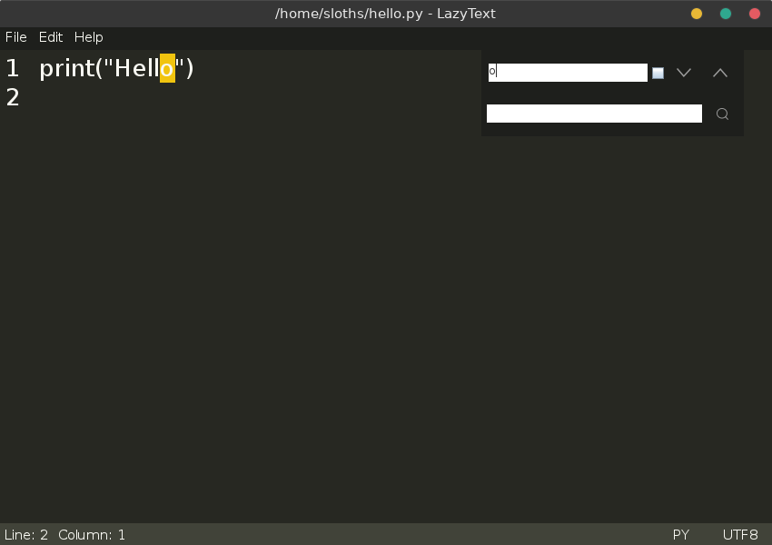
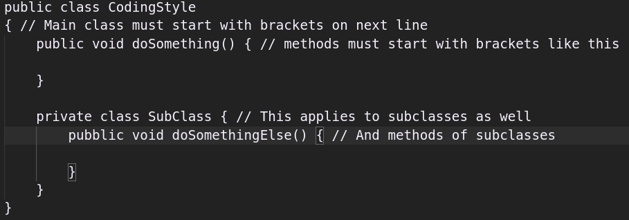
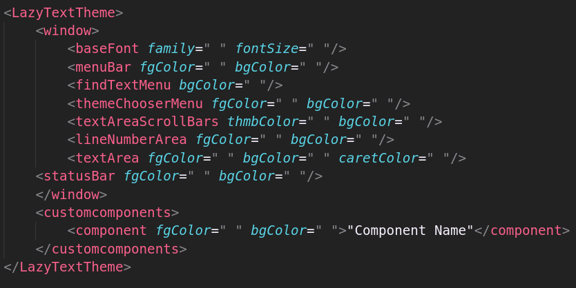
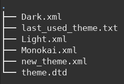
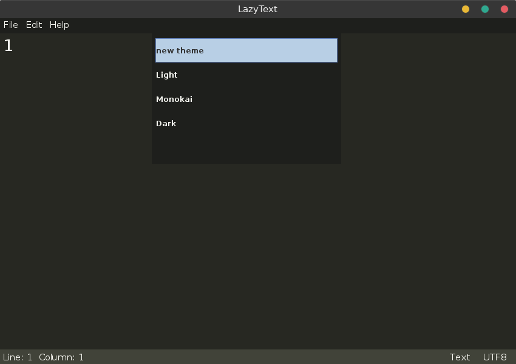
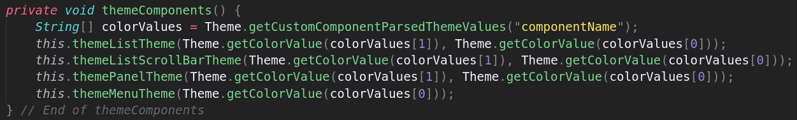

# LazyText Editor 
Lightweight text editor in the making written in Java using Swing

# Current Features Available
* Cut/Copy/Paste
* Undo/Redo
* Keyboard Shortcuts
* Line Numbers
* XML Theming System
  * Current Themes available:
  * Light
  * Dark
  * Monokai
* Ability remember last set theme
* File Reading/Writing
  * Close currently loaded files
  * Reload newly 'Saved As' files
* Find Text
  * Regex support
  * Highlight Found Text
  * Walk throughout highlighted text
* Find and Replace Text
* Status bar
  * Display current line and column number
  * Display File Extension
  * Display File Encoding

# Project Structure

* **LazyText.java**
  * _handles displaying the actual program_

* **Theme.java**
  * _Handles anything & everything within the XML Theming System_

* **ThemeChooser.java**
  * _Handles displaying all themes available & setting themes_

* **MenuBarItemListener.java**
  * _Handles all events each menuBarItem dispatches_

* **MenuBarUtils.java**
  * _Handles all functions related to the menuBar_

* **LineNumberListener.java**
  * _Handles updating the current line & column the caret is on_

* **NewLineListener.java**
  * _Handles adding a new line number when needed_

# Contributing

* This ensures the project's codebase is kept consistent & easy to understand

1. Follow this coding style

   

2. Use descriptive variable & method names

3. Use seperation of concerns

4. Use single responsibility principle

5. Add comment at the end of a method/class depicting it's end point
   on a new line as such:
   
   `// End of methodName/className`

# Building From Source
* Can be built using MAVEN

# Building Custom Themes

* First use `new_theme_template.xml` as a base to create a theme
  then fill in values with desired **hexadecimal** values all except 
  `<baseFont>` and `<customcomponents>` are required

  

* Second place **new_theme.xml** file in within the **themes/** directory in **res/**
  
  

* Lastly select your newly added theme from the `Themes` menu (via `CTRL+K`) and you're done

  

## Theming New Components

* To theme newly added components you will have to include it within the xml file
  under `<customcomponents>` and make custom methods that theme all components you wish to include and use the 
  `static` method, `Theme.getCustomComponentParsedThemeValues("nameOfComponent");` & `getColorValue("hexadecimalString")`.
  Which returns a `String[]` of values specified by you for your component and convert any hexadecimal string
  into it's corresponding color

  